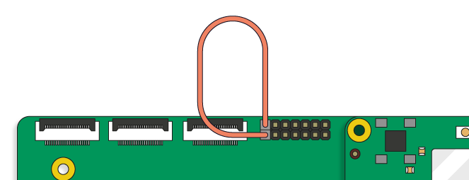
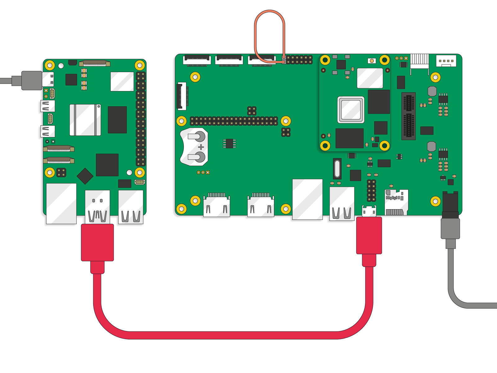

This page introduces Raspberry Pi *Secure Boot Provisioner* (`rpi-sb-provisioner`). Secure Boot Provisioner automates the secure (verified) boot and disk encryption setup process, and supports the provisioning of multiple Raspberry Pi devices. As part of its workflow, Secure Boot Provisioner automates tasks that would otherwise require manual, multi-step setup, including firmware flashing, OS image writing, key generation, and activating hardware-level protection mechanisms.

IMPORTANT: This tool is in active development, which means it's currently being improved and updated. If you find any bugs or if you want to suggest features, let us know on GitHub: https://github.com/raspberrypi/rpi-sb-provisioner.

== Secure boot provisioning

Provisioning is the process of preparing a device for use by installing an operating system (OS), configuring security settings, and ensuring the device is ready for use. Doing this manually for multiple devices is time-consuming and introduces risk of error.

Raspberry Pi's Secure Boot Provisioner is a tool that automates these steps for provisioning so that you don't have to do them manually, and allows you to provision multiple Raspberry Pi devices. It ensures that each client device is provisioned with a trusted OS image, configured security settings, and encryption keys.

=== Key features

With Raspberry Pi's Secure Boot Provisioner, you can prepare each client device with the following:

* *Secure boot protection.* Secure boot ensures that only firmware and OS images signed with trusted cryptographic keys run on each device during its startup sequence. The secure boot chain verifies each component before running it, from bootloader through to OS. This prevents unauthorised software from running on the device. Secure Boot Provisioner programs and configures the low-level firmware that initialises the device, forming the foundation of the secure (verified) boot process. For more information, see <<secure-boot>> on this page.
* *Encrypted storage.* To protect data, you can configure Secure Boot Provisioner to encrypt each device's storage using full-disk encryption. This is recommended because encryption ensures that data remains inaccessible even if someone bypasses the boot media or removes the storage. The encryption key is unique and tied to the hardware, so the data remains protected and unreadable on other systems. For more information, see <<encryption>> on this page.
* *Secure OS deployment.* Secure Boot Provisioner securely installs a custom OS image by packaging it into a secure, encrypted container that only the device's firmware can load. The provisioner automatically installs this OS image during setup, ensuring a trusted and repeatable deployment process. You create a single base ('master') image, and the tool replicates it to all client devices with appropriate security modifications.
* *Manufacturing records.* Secure Boot Provisioner maintains a manufacturing database that details each client device's serial number, MAC address, provisioning timestamp, and security configuration. These records support inventory tracking, warranty validation, and customer support operations.
* *Consistent configuration.* Every device prepared with Secure Boot Provisioner receives an identical configuration, eliminating human error and configuration drift. This ensures consistent behaviour across your client devices and simplifies ongoing management and technical support operations.
* *Raspberry Pi Connect for Organisations registration.* You can configure Secure Boot Provisioner to automatically register provisioned devices with Raspberry Pi Connect for Organisations. For more information, see xref:../services/connect-for-organisations.adoc#bulk-provisioning[Bulk provisioning].

=== Use cases

Secure Boot Provisioner is useful for:

* Businesses building products with Raspberry Pi devices.
* Manufacturers producing devices at scale.
* System integrators deploying secure systems.
* Anyone who needs to prepare multiple Raspberry Pi devices with security features.

Because the tool automatically handles cryptographic operations and security configuration, Secure Boot Provisioner offers the following benefits:

* *Security.* Trusted boot and encrypted data storage.
* *Efficiency.* Speeds up the provisioning process and removes the need for manual cryptography or firmware knowledge.
* *Reliability.* Ensures consistency and reduces errors that might otherwise occur with manual setup.
* *Simplicity.* Doesn't require security expertise to operate. Knowledge of encryption algorithms or boot chain implementation is unnecessary.

[[core-concepts]]
=== Core security concepts

Secure Boot Provisioner relies on two complementary mechanisms to secure devices: <<secure-boot, secure (verified) boot>> and <<encryption, disk encryption>> using LUKSv2, summarised below. For more detailed information about Raspberry Pi's secure boot and encryption implementation, see xref:../security/security-architecture.adoc[Security architecture].

[[secure-boot]]
==== Secure (verified) boot

Raspberry Pi secure boot is a security mechanism that uses sequential verification, starting from immutable hardware, to check that each stage of the boot process is authenticated. With secure boot, your Raspberry Pi device only boots software that you've signed with your private key. No one can modify the firmware or OS image (`boot.img`) without your signature.

When secure boot is enabled on a Raspberry Pi device with Secure Boot Provisioner, the device verifies that each boot-stage binary (such as the bootloader) is cryptographically signed with a trusted private key before the OS starts. Your Raspberry Pi device stores the hash of the corresponding public key in its secure storage (OTP memory) and uses it to validate the signatures before booting. This ensures that only trusted, signed binaries can run during boot, preventing tampering or unsigned code from being loaded, whether from local storage or over the network.

For more detailed information about Raspberry Pi's secure boot implementation, see xref:../security/security-architecture.adoc[Security architecture].

[[encryption]]
==== Disk encryption

We strongly recommend combining secure boot with encryption. Without encryption, data on your Raspberry Pi device can still be accessed if the storage media is removed or compromised. Conversely, encryption without secure boot doesn't protect the private key stored in OTP from someone with root access. With secure boot, every stage of the boot process is cryptographically verified, and so only signed software can run on your Raspberry Pi device before the private key is accessed.

You can use Secure Boot Provisioner to prepare your Raspberry Pi device with:

* *LUKSv2 (Linux Unified Key Setup)* encryption, which is the standard format for disk encryption on Linux.
* A device-unique secret in the *one-time programmable (OTP)* memory area of your Raspberry Pi device.

The device-unique secret in your device's OTP is loaded early during the boot process and then used to unlock a LUKS-encrypted file system, allowing your Raspberry Pi device to decrypt its storage without requiring you to enter a password.

For more detailed information about Raspberry Pi's disk encryption implementation, see xref:../security/security-architecture.adoc[Security architecture].

==== Application layer hardening

After provisioning devices with secure boot and disk encryption, we strongly recommend that you consider using software components to harden your operating system. For more information, see xref:../security/security-architecture.adoc#software-components[Software components in Raspberry Pi OS].

[[security-levels]]
=== Levels of security

As part of the Secure Boot Provisioner setup process, you can choose between three styles of operation that differ by the combination of secure boot and encryption applied to your client device to suit your security needs:

.The three styles of security that you can choose for Secure Boot Provisioner
[cols="1,3,2", options="header"]
|===
|Mode |What it does |When to use it

|`secure-boot`
|*Full security (secure boot + encryption + device-unique secret).* Ensures that only trusted software can run on a device during startup. It creates a unique encryption key for the client device, partitions and formats the storage, creates a *LUKSv2* encrypted container, places the OS image into that encrypted container, and places a signed, customised pre-boot authentication environment in the device's boot partition.
|Use for production devices that need maximum security. This also writes the hash of the customer key into OTP and writes updated firmware into EEPROM.

|`fde-only`
|*Full disk encryption without secure boot.* Completes the same actions as `secure-boot`, but the customised pre-boot authentication environment is unsigned.
|Use when you need encryption but not secure boot restrictions. We don't recommend choosing this option because third parties can still read the encryption key.

|`naked`
|*No encryption, no secure boot.* Automatically partitions and formats the storage, and places the OS image directly onto the connected device's storage without encryption or pre-boot environment.
|Typically used for development and testing, or for minimal setups that don't have security requirements.
|===

[[prerequisites]]
== Prerequisites

Before you begin the provisioning process, ensure you have the following:

=== Software assets

* *An OS image to provision.* This can be Raspberry Pi OS (we recommend Trixie) or a custom OS image that includes your own software, settings, and configurations. You can use Raspberry Pi's official OS image builder, `rpi-image-gen`, to create a custom OS image. For information about `rpi-image-gen`, see the https://github.com/raspberrypi/rpi-image-gen[rpi-image-gen documentation in GitHub].
* *An RSA key pair.* An RSA 2048-bit private-public key pair to sign the bootloader image with. Keep this private key secure. For instructions, see <<rsa, Prepare a secure boot key pair>> on this page.

=== Provisioning (host) server

You must have a 64-bit Raspberry Pi device to act as a server; we recommend *Raspberry Pi 5*. This device has the following requirements:

* *Power supply.* An official Raspberry Pi 27 W USB-C power supply.
* *Operating system.* An installation of Raspberry Pi OS Trixie, or later.
* *Storage.* At least 32 GB of free storage for temporary working files.
* *Connector.* See the table in <<client-devices>>, below.

The provisioning server must also have a single 'master' copy of the OS to serve as the template for the devices you provision. You upload this OS image to your provisioning server as part of steps outlined in <<configure, Configure your provisioning server>> on this page.

[[client-devices]]
=== Client Raspberry Pi devices and cables

You must have at least one RPIBOOT-capable client device to connect to the provisioning server. This allows you to modify the device over a USB connection, which is the mechanism by which you enable and configure secure boot.

We strongly recommend using Compute Module 4 or 5 as your client devices, but you can use Secure Boot Provisioner to prepare any of the following RPIBOOT-capable Raspberry Pi devices. The connectors you need depend on the devices that you want to prepare.

.Supported client devices in order of recommendation, and the corresponding required cables and accessories for Secure Boot Provisioner
[cols="1,2", options="header"]
|===
|Client device |What you need for provisioning

|Compute Module 5 (CM5)
|USB-A to USB-C cable, Compute Module 5 IO Board (CM5IO), and a jumper wire

|Compute Module 4 (CM4)
|USB-A to micro USB-B cable, Compute Module 4 IO Board (CM4IO), and a jumper wire

|Compute Module 4S (CM4S)
|USB-A to micro USB-B cable and Compute Module IO Board version 3 (CMIO3)

|Raspberry Pi 5, 500, and 500+
|USB-A to USB-C cable
|===

[[provisioning]]
== Provisioning process
After creating your OS image (either Raspberry Pi OS or your own custom image, summarised in <<prerequisites>>), the broad process for using Secure Boot Provisioner to prepare Raspberry Pi devices is as follows, with the last step repeated for each device you want to provision:

* <<rsa>>
* <<configure>>
* <<connect>>

[[rsa]]
=== Prepare a secure boot key pair (one time)

Secure boot requires a 2048-bit RSA private-public key pair:

* The private key (`private.pem`) is used by the provisioning server to sign the bootloader image before it's written to each client device during provisioning. It's important that you keep the private key secure because, when your client device is locked to this key, only images signed with this key can boot the Raspberry Pi device.
* A hash of the public key is injected into each client device during provisioning, and is then used to verify the bootloader signature during boot. This hash is used to verify an image signed with your private key, and is stored in OTP.

When the client device boots, it computes a hash of the public key corresponding to the signature on the bootloader image and compares it to the hash stored in OTP. If the hashes match, the signature verifies and the boot continues.

You can either use a pre-existing key pair or generate a new one. The following instructions walk you through generating a new RSA 2048-bit private-public key pair using OpenSSL.

If you already have a suitable key pair, you can skip these instructions.

. Generate a 2048-bit RSA private key and save it in a `private.pem` file in your home directory:
+
[source,console]
----
$ cd $HOME
$ openssl genrsa 2048 > private.pem
----
. Extract the public key from the private key you just created; a hash of this key is to be stored in the OTP of your client device to verify bootloader images signed with the private key:
+
[source,console]
----
$ openssl rsa -in private.pem -pubout -out public.pem
----

WARNING: You must keep the private key secure. If you lose access to the private key, your devices can no longer be updated or recovered with trusted bootloader images. If someone gains access to the private key, your device is no longer secure. We recommend using a combination of encrypted storage, restricted access, and a hardware security module (HSM).

[[configure]]
=== Configure your provisioning server (one time)

Before you can provision client devices, you must first configure a host computer (such as a Raspberry Pi 5) to be the *provisioning server* device. This provisioning server is then used to provision one or more RPIBOOT-capable *client devices* (such as a Compute Module 4 or 5). For information about eligible hardware, see <<prerequisites>> on this page.

How the storage on your client device is prepared and how security features are applied depends on the provisioning style (`PROVISIONING_STYLE`) you choose during the setup of your provisioning server. There are three modes of operation to choose from: `secure-boot`, `fde-only`, or `naked`. For information about these provisioning styles, see <<security-levels>>.

The following instructions walk you through installing the Secure Boot Provisioner (`rpi-sb-provisioner`) onto your provisioning server, importing your RSA key pair, uploading your OS image, and configuring other options, including your bootloader signing settings.

First, run the following commands on the provisioning server that you're using to prepare and provision other Raspberry Pi devices:

. Update your provisioning server to the latest software:
+
[source,console]
----
$ sudo apt update && sudo apt full-upgrade -y
----
. Install Secure Boot Provisioner:
+
[source,console]
----
$ sudo apt install -y rpi-sb-provisioner
----
. In a browser, open the configuration interface (http://localhost:3142). The following command opens your web browser to the local configuration page in the web UI for `rpi-sb-provisioner`:
+
[source,console]
----
$ xdg-open http://localhost:3142
----

Next, open the *Options* tab of the web UI, and complete each of the following sections.

. Under *OS Image*, select or upload the operating system (OS) file to provision. For information about creating your own OS image file, see <<prerequisites>> on this page.
. Under *Device & Firmware > Device Family*, select which Raspberry Pi devices you want your provisioning device to prepare (for example, Compute Module 4).
. Under *Device & Firmware > Storage Type*, select the storage type that your client devices are using: *SD card* (a standard microSD card), *eMMC* (embedded flash storage on Compute Modules), or *NVMe* (NVMe SSD storage).
. Optionally, under *Device & Firmware > Device Firmware*, select the bootloader version you want to deploy to your client devices. This change might affect the performance or security of your client device. We recommend choosing the latest default release.
. Optionally, under *Device & Firmware > Bootloader Configuration*, specify a path to a custom bootloader configuration file. This allows you to define additional EEPROM parameters that aren't offered with Raspberry Pi's secure boot provisioner. For more information, see xref:../computers/raspberry-pi.adoc#raspberry-pi-bootloader-configuration[Raspberry Pi bootloader configuration].
. Under *Security Configuration > Provisioning Style*, choose one of the three provisioning options. For details about these options, see <<security-levels>> on this page.
. Under *Security Configuration > Encryption Cypher*, choose between the following options. Newer Raspberry Pi devices use hardware accelerators. For more information, see xref:../security/security-architecture.adoc#disk-encryption[Disk encryption boot flow] in the xref:../security/security-architecture.adoc[Security architecture] page.
** *AES-XTS.* Choose this option if the SoC on your Raspberry Pi is either BCM2711 or BCM2712.
** *Adiantum.* Choose this option if the SoC on your Raspberry Pi is BCM2837B0 or older.
. Under *Security Configuration > Bootloader Signing Key (RSA 2048-bit)*, create or upload a 2048-bit RSA private-public key pair. This is only relevant if you chose `secure-boot` as your provisioning style.
** If you don't yet have an RSA key pair, follow the on-screen instructions for creating a signing key.
** If you've already created an RSA key pair, as described in <<rsa, Prepare a secure boot key pair>>, upload the file to this section.
. Under *Storage & Output*, configure where the provisioning data and logs are stored. This is where you enter your:
** *Work Directory (Recommended)*. The cache location for operating system assets between provisioning runs.
** *Manufacturing Database.* The SQLite database that stores device information (serial numbers, MAC addresses, and hardware details). Use local storage only.
** *Keypair Storage Directory (Optional).* The directory that stores each client device's unique cryptographic key pairs generated during provisioning. Device key pairs are sensitive information and so you must ensure appropriate access controls. Leave this section blank to store keys alongside logs in the work directory.
. If you want client devices to be automatically registered with *Raspberry Pi Connect for Organisations*, enable device registration during provisioning. Under *Cloud Services*, enter your organisation's management API access token, which you can find in the *Settings* tab of your Raspberry Pi Connect organisation. For more information, see xref:../services/connect-for-organisations.adoc#bulk-provisioning[Bulk provisioning].
. Under *Hardware Security* (optional), use the toggles to permanently enable the following options on client devices. These settings can't be reverted on provisioned client devices; only enable them if you're certain of your configuration.
** *Lock JTAG Access.* This restricts debugging access to the client device. This is off by default because, after it's enabled, it prevents Raspberry Pi engineers from assisting with hardware debugging.
** *Enable EEPROM Write Protection.* This prevents modification of the provisioned device's EEPROM, which protects the secure boot configuration. For more information about EEPROM write protection, see xref:../computers/config_txt.adoc#eeprom_write_protect[`eeprom_write_protect`].

Configuration is now complete and you can start provisioning your first device.

[[connect]]
=== Connect to and provision your client devices

After configuring your provisioning server with Secure Boot Provisioner, you can provision your client devices.

The first step is to connect each client device in RPIBOOT mode to your provisioning server. Connecting the provisioning server to a device in RPIBOOT mode automatically initiates the provisioning software, `rpi-sb-provisioner`, which installs the secure OS image, programs the firmware, and applies the keys and encryption.

NOTE: RPIBOOT mode is the engineering label for USB device mode, which enables the provisioning server to communicate with the client device over USB.

The way you connect your devices depends on the client device model and how it enters RPIBOOT mode:

* Compute Modules 4 and 5 connect to the provisioning server through the corresponding IO Board and enter RPIBOOT mode using a jumper wire. For instructions, see <<connect-to-cm4-5>>.
* Compute Module 4S connects to the provisioning server through the CMIO3 Board and enters RPIBOOT mode using the jumper header on the CMIO3 Board. For instructions, see <<connect-to-cm4s>>.
* Raspberry Pi 5 requires that you press and hold its power button at a specific time during the connection process. For instructions, see <<connect-to-rpi5>>.

WARNING: Don't connect other USB devices to the client device during provisioning. The provisioning Raspberry Pi can only supply 900 mA of power to the connected device.

Secure Boot Provisioner runs in the background using three separate `systemd` services. All provisioner operations are automatic, but you can still monitor its progress from the *Devices* tab of the web UI at http://localhost:3142.

When complete, the `activity` and `power` LEDs on the client device turn off. On Raspberry Pi 5 devices, which have a bi-colour LED, both functions are provided by the same LED. In this state, your device is safe to power off, disconnect from the provisioning server, and package into your product.

NOTE: You might still see activity from the Ethernet port if you have Ethernet connected.

The device is then ready for deployment and you can attach the next client device to your provisioning server. Typically, for a 1.6 GB OS image, provisioning takes approximately 3 minutes for each device.

[[connect-to-cm4-5]]
==== Connect to a Compute Module 4 or 5

The provisioning server is connected to a Compute Module 4 or 5 through a USB cable attached to the corresponding IO Board. Additionally, you must attach a jumper wire to the correct pins on the IO Board to force the attached Compute Module into RPIBOOT mode.

The following instructions provide guidance using CM4 on a CM4IO Board as an example, but can be applied to CM5 on a CM5IO Board.

After completing the following steps, the provisioning process starts automatically, as described in <<provisioning-pipeline>> on this page.

===== Step 1. Attach the Compute Module to its corresponding IO Board

Align the mounting holes and the dual 100-pin connectors on the Compute Module with those on your IO Board and press gently but firmly to attach them to each other.

Although the form factors of Compute Module 4 (CM4) and Compute Module 5 (CM5) are physically compatible with the CM4IO and CM5IO boards, we strongly recommend only using the IO Board designed for the Compute Module model. This is because there isn't pin-to-pin parity between the connectors, with several signals assigned differently between CM4 and CM5. Using a mismatched IO Board results in missing functionality.

===== Step 2. Enable RPIBOOT mode

At the top of the Compute Module IO (CMIO) Board, use the jumper wire to connect the two `disable eMMC Boot` pins (located on the far left side of the 12-pin header). This puts the Compute Module into RPIBOOT mode, allowing you to provision your custom OS image into the eMMC from your provisioning server instead.

.Jump wire position to put the Compute Module IO Board into RPIBOOT mode

===== Step 3. Connect your provisioner server to the IO Board.

Use the USB cable to connect your provisioning server to the IO Board. When power is supplied to the Compute Module, RPIBOOT mode is activated.

* For CM4, power is directly supplied to its corresponding IO Board (CM4IO).
* For CM5, power is supplied by the USB cable from the provisioning server.

As an example, the following diagram shows a correctly connected provisioning setup with a Raspberry Pi 5 (on the left) as the provisioning server connected to a CM4 through a connected CM4IO (on the right). The red wire in the diagram connects the provisioning server to the CMIO Board; the grey wires in the diagram supply power.

.A Raspberry Pi 5 provisioning server (left) connected to a Compute Module 4 (right)

===== Step 4. Monitor the provisioning process

During provisioning, monitor your Compute Module IO Board's LEDs. Provisioning is complete when both LEDs are off. You can then disconnect the client device from the provisioning server and use the client device as intended.

[[connect-to-cm4s]]
==== Connect to a Compute Module 4S

The provisioning server is connected to a Compute Module 4S through a USB cable attached to a Compute Module IO Board version 3 (CMIO3) Board. Additionally, you move the position of the pin jumper on the header to force the attached Compute Module into RPIBOOT mode.

After completing the following steps, the provisioning process starts automatically, as described in <<provisioning-pipeline>> on this page.

===== Step 1. Attach the Compute Module 4S to the CMIO3 Board

Insert the bottom edge of the Compute Module 4S (CM4S) into the SODIMM connector on the CMIO3 Board, then tilt the CM4S backward until it lies flat against the CMIO3 Board, and the retaining clips hold it in place.

===== Step 2. Enable RPIBOOT mode

On the header labelled `USB SLAVE BOOT ENABLE` at the bottom-right of the CMIO3 Board, move the pin jumper from the right-most two pins (labelled `DIS`) to the left-most two pins (labelled `EN`). This puts the CM4S into RPIBOOT mode, allowing you to provision your custom OS image into the eMMC from your provisioning server instead.

===== Step 3. Connect your provisioner server to the IO Board.

Use the USB cable to connect your provisioning server to the CMIO3 Board through the `USB SLAVE` port. RPIBOOT mode is activated on the CM4S when power is supplied to the `POWER IN` port on CMIO3 Board.

===== Step 4. Monitor the provisioning process

During provisioning, monitor your CMIO3's LEDs. Provisioning is complete when both LEDs are off. You can then disconnect the client device from the provisioning server and use the client device as intended.

[[connect-to-rpi5]]
==== Connect to a Raspberry Pi 5

Raspberry Pi 5 has a built-in power button. Connecting your provisioning server to a Raspberry Pi 5 requires that you press and hold this power button at a specific time during the connection process.

We strongly recommend that you use a high-quality USB-A to USB-C cable. Poor cables can cause connection problems and interfere with the provisioning process.

The initial connection activates RPIBOOT mode, allowing the client Raspberry Pi 5 to be provisioned by the provisioning server.

. Plug the USB-A end of the connecting cable into your provisioning server (typically, another Raspberry Pi 5 configured using the instructions in <<configure, Configure your provisioning server>>).
. Hold down the power button on your client Raspberry Pi 5 (not your provisioning server); while holding the button, plug the USB-C end of the cable to the client Raspberry Pi 5.
. Keep holding the power button down until the provisioning server recognises the client device, as indicated in the web interface or system logs. Then, release the button. The device then starts the bootstrap phase of the provisioning process, summarised in the <<provisioning-pipeline>>.
. During provisioning, monitor your client Raspberry Pi 5's LEDs. Provisioning is complete when both LEDs on the client Raspberry Pi are off. You can then disconnect the client device from the provisioning server and use the client device as intended.

[[provisioning-pipeline]]
== Provisioning pipeline

When connected to a client device in RPIBOOT mode, the provisioning server automatically runs `rpi-sb-provisioner`, which performs the following actions:

. *Detect.* The provisioning server detects the connected device (in RPIBOOT mode) over USB. This initiates the provisioning workflow using background `systemd` services.
. *Bootstrap.* If the provisioning style is set to `secure-boot`, a special Raspberry Pi firmware writes the public signing key hash (from `CUSTOMER_KEY_FILE_PEM`) to OTP memory.
. *Update.* The provisioning server updates the SPI flash EEPROM containing the bootloader to the specified firmware.
. *Triage.* A transitory Linux distribution runs on the device to determine next steps. `rpi-sb-provisioner` on the provisioning server decides how to proceed based on your configured `PROVISIONING_STYLE`: `secure-boot`, `fde-only` (full-disk encryption), or `naked` (unencrypted, unsigned OS). For more information about provisioning styles, see <<security-levels>>.
. *Provision.* The system installs firmware, keys, OS image, and so on, according to your chosen provisioning style.

When provisioning is complete, the connected device's activity and power LEDs turn off, signalling safe shutdown and completion. You can then connect the next device that you want to provision.

When provisioned, the client device:

* Verifies the signed bootloader on startup using the public key stored in OTP.
* Only boots images signed by your trusted private key.
* If you also configure full-disk encryption (recommended), decrypts its storage at boot using the device-unique secret before loading the OS.

== Troubleshooting

If you experience issues when using Secure Boot Provisioner to provision a device, use the information in this section to address or diagnose the issue.

* Check whether you are experiencing a common problem (see <<common-problems>>).
* Check the logs for error messages (see <<check-the-logs>>).
* Clear the cache (see <<clear-the-cache>>).
* If you are unable to resolve your issue, contact us to report the issue (see <<get-help>>).

[[common-problems]]
=== Common problems

This section describes common problems that you might encounter when using Secure Boot Provisioner and suggests ways to resolve them.

==== Provisioning stops or never completes

If provisioning starts but stops part way or never finishes, try the following:

. Check the logs for error messages (see <<check-the-logs>>).
. Clear the cache (see <<clear-the-cache>>).
. Check that the provisioning server has at least 32 GB of free storage space.
. Try provisioning a different client device to determine whether the problem is device-specific.

==== Error: "Already signed"

If the error logs report that the client device is already signed or secure, the client device was previously programmed with a signing key. This operation is permanent and can't be reversed. However, the following actions are available for this CM5:

* To skip the signing step, set the *Skip EEPROM Update* flag for this device.
.. Go to the Secure Boot Provisioner web UI at http://localhost:3142.
.. Go to the *Devices* tab and select the device you're programming.
.. On the device-specific page, in the *Special Flags* section, set *Skip EEPROM Update* to *One-time*.

* To use the same key to completely re-provision the device, set the *Re-provision Device* flag for this device.
.. Go to the Secure Boot Provisioner web UI at http://localhost:3142.
.. Go to the *Devices* tab and select the device you're programming.
.. On the device-specific page, in the *Special Flags* section, set *Re-provision Device* to *One-time*.

[[check-the-logs]]
=== Check the logs

If a provisioning attempt fails, you can check the logs for error details.

[tabs]
======
Using the web interface::
+
. Go to the Secure Boot Provisioner web UI at http://localhost:3142.
. Select the *Services* tab.
. Find your CM5 in the *System Services* table.
. Select *View logs* to view detailed logs about it.

Using the command line::
+
Run the following command, replacing `<serial>` with the device serial number:
+
[source,bash]
----
tail -f /var/log/rpi-sb-provisioner/<serial>/provisioner.log
----
+
For more detailed logs, run the following command, replacing `<serial>` with the device serial number:
+
[source,bash]
----
journalctl -xeu rpi-sb-provisioner@<serial> -f
----
======

[[clear-the-cache]]
=== Clear the cache

If old files cause problems, you can clear the provisioning cache. Clearing the provisioning cache causes the next provisioning operation to take longer.

. Go to the Secure Boot Provisioner web UI at http://localhost:3142.
. Select the *Options* tab and the *OS Image* section.
. Select the OS image that you want to clear from the provisioning cache.
. Select *Clear cached files*.
. On the confirmation window, select *OK* to confirm the action.

[[get-help]]
=== Get help

If you encounter a problem that isn't covered in this section, report it at https://github.com/raspberrypi/rpi-sb-provisioner/issues[the rpi-sb-provisioner issue tracker]. Include the device type that you're trying to provision, error messages, and <<check-the-logs, log files>>.