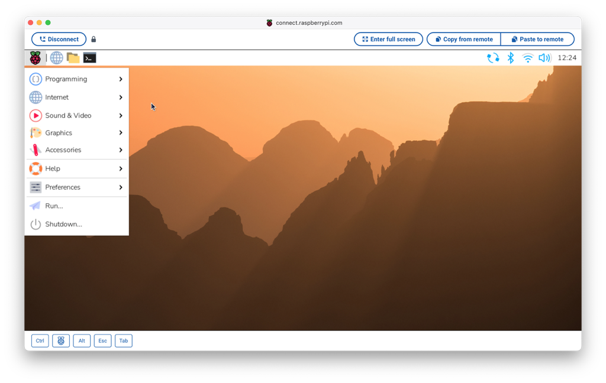
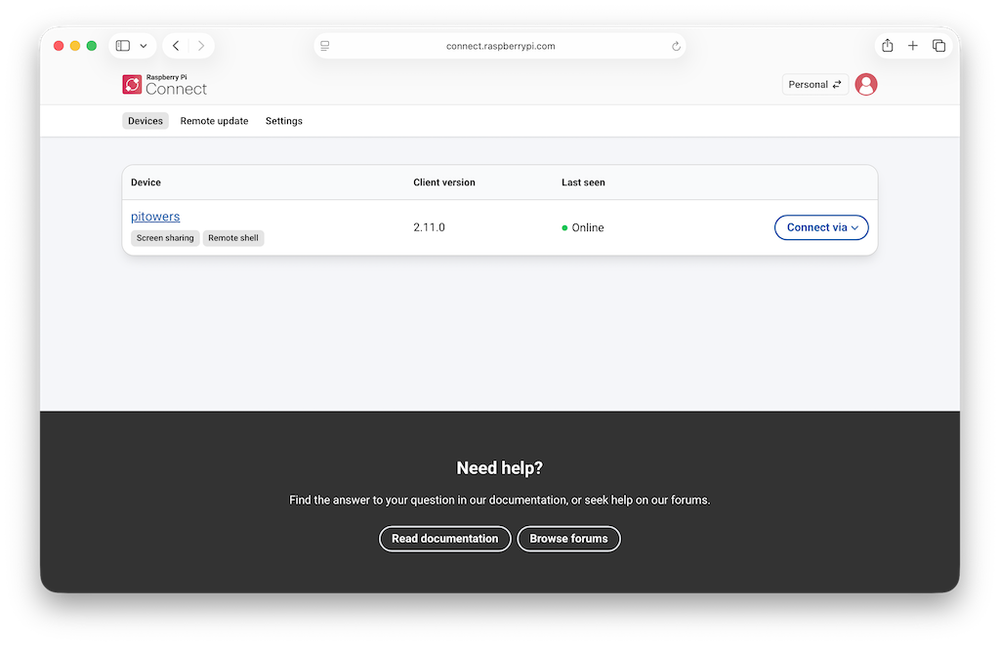
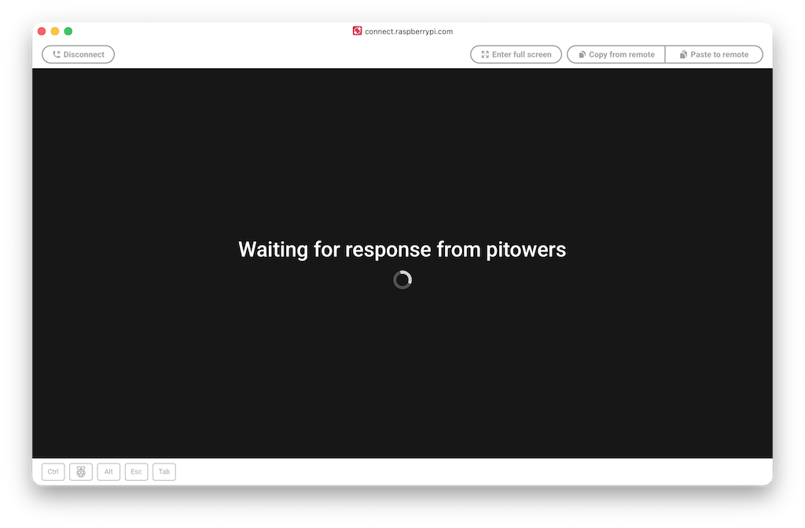
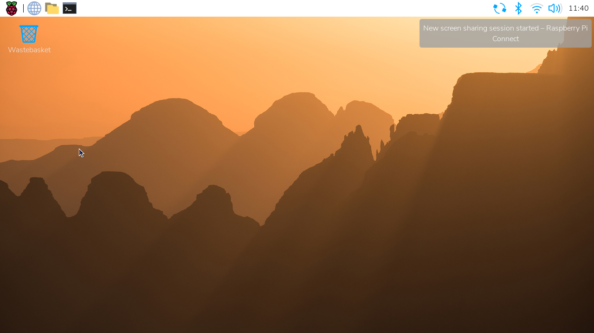
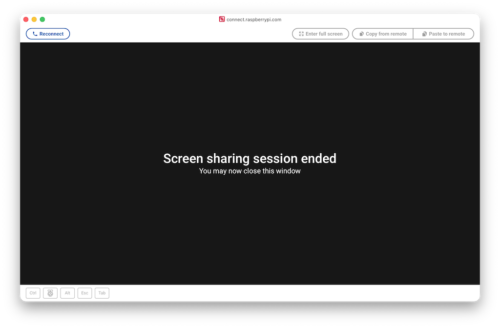
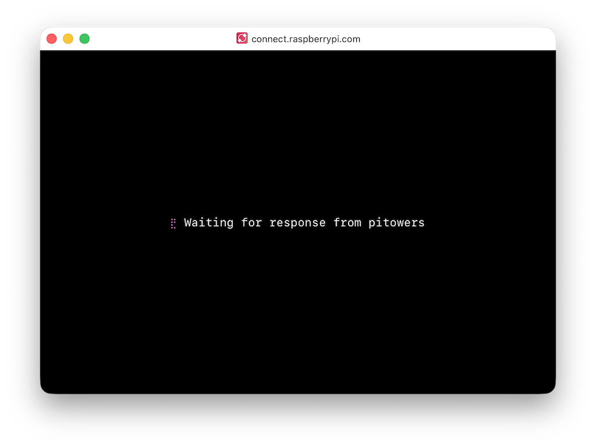
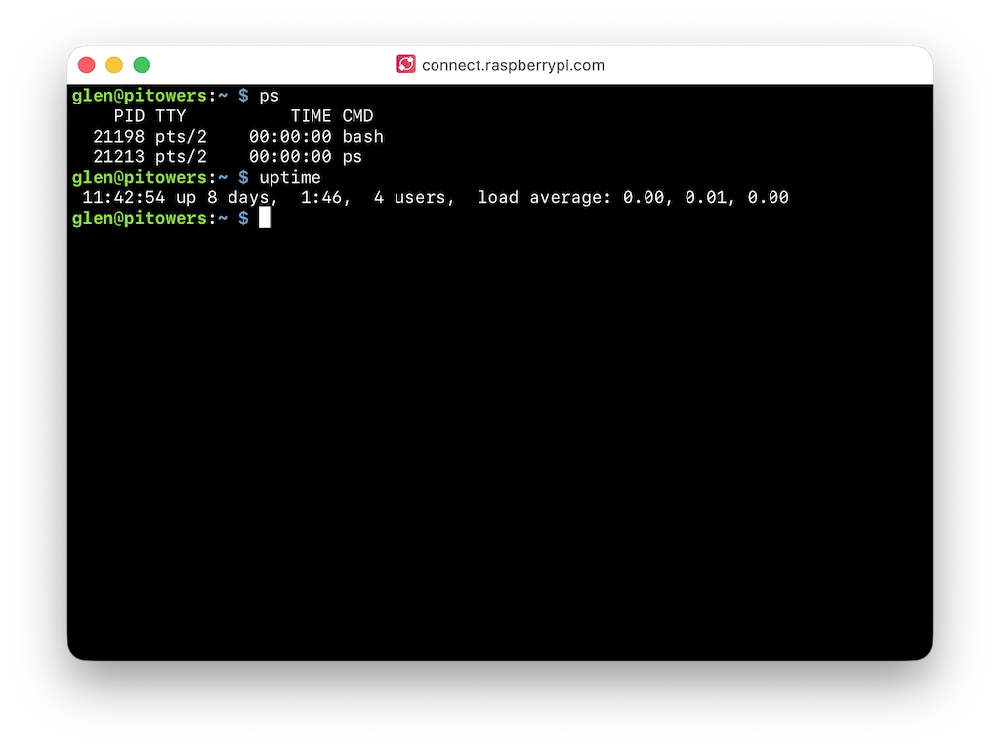
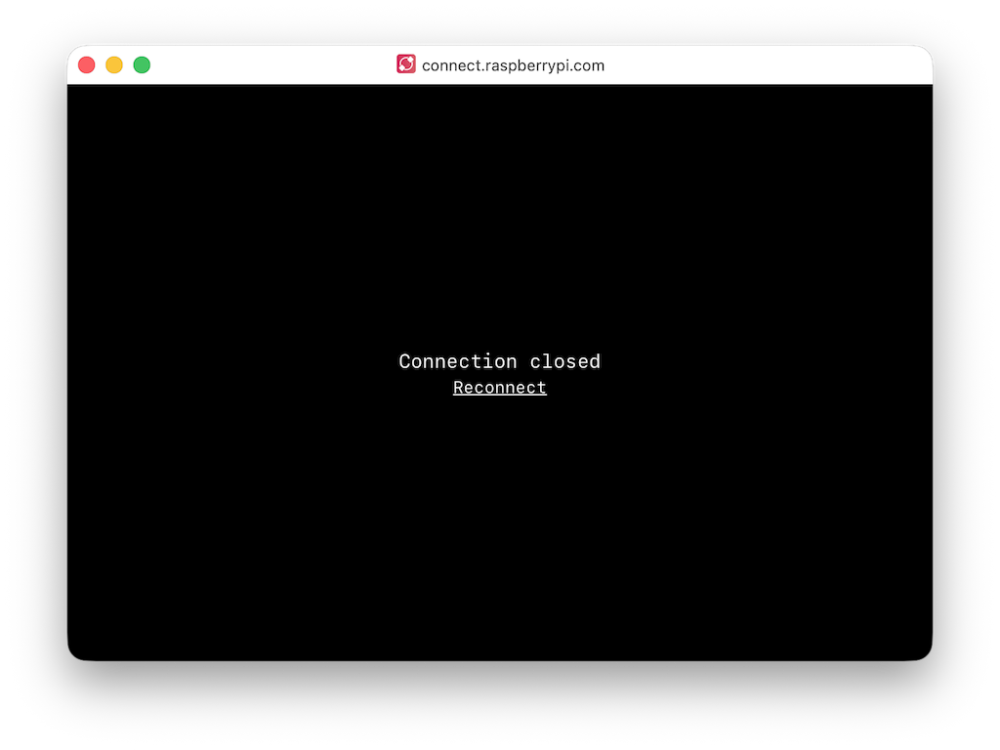
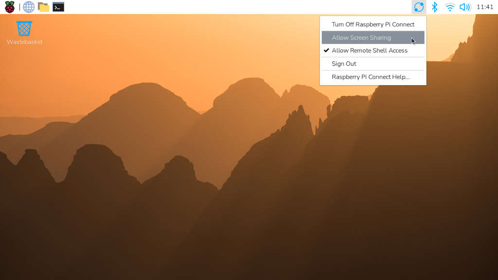
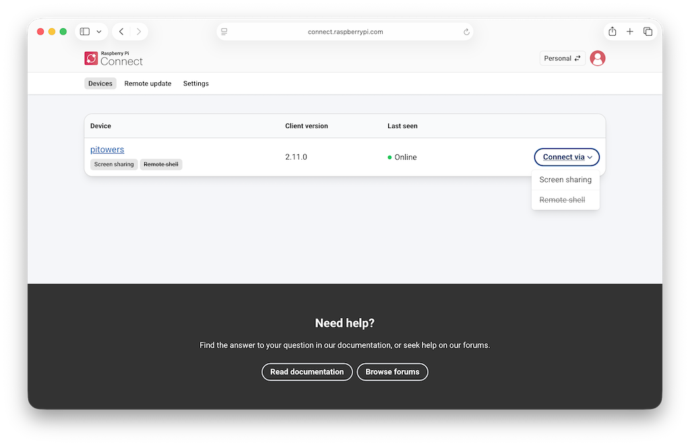

== Access your device in Connect

After you've linked your Raspberry Pi device to your Connect account, you can access it from anywhere using only a web browser.

You can do this using either of the following methods:

* Screen sharing
* Remote shell

Screen sharing requires the **Wayland** window server. Raspberry Pi OS _Bookworm_ and later use Wayland by default. Screen sharing isn't compatible with Raspberry Pi OS Lite or systems that use the X window server.

=== Screen-sharing interface
[[screen-sharing]]

Connect's screen-sharing interface is designed for both desktop and mobile devices.

You can simulate common keyboard functions using the buttons at the bottom left of the interface:

* **Keyboard**. Toggles the on-screen keyboard. Displayed only on mobile devices.
* **Ctrl**. Simulates holding down this key on a physical keyboard.
* **Super key**. Simulates holding down this key on a physical keyboard.
* **Alt**. Simulates holding down this key on a physical keyboard.
* **Esc**. Simulates a single press—pressing and then releasing—of this key.
* **Tab**. Simulates a single press—pressing and then releasing—of this key.

You can also use the buttons at the top of the browser window to complete other useful tasks:

* **Copy from remote**. Transfer text from the device's remote clipboard to your local clipboard.
* **Paste to remote**. Transfer text from your local clipboard to the device's remote clipboard.
* **Enter full screen**. Expand the browser window to full size.
* **Disconnect**. Terminate the sharing session.

==== Start screen sharing

To start a screen sharing session:

. Make sure your Raspberry Pi device is linked to your Connect account, is powered on, and that Raspberry Pi OS has booted.
. From your PC, Mac, or other device, sign in to https://connect.raspberrypi.com[connect.raspberrypi.com].
. Select the **Devices** tab.
+
Devices available for screen sharing show a grey **Screen sharing** badge below the name of the device.
+

+
. Select the **Connect via** button to the right of the device you want to access.
. Select the **Screen sharing** option from the menu.
+
A browser window opens that displays your device's desktop, and you can now use your device in the same way as a local device.
+

+
When screen sharing has started, a green dot appears next to the **Screen sharing** badge in the Connect dashboard. This indicates an active screen sharing session. Hover over the dot to see the current number of screen sharing sessions.
+

+
The Connect icon in the system tray rotates when a screen sharing session is in progress. A desktop notification appears whenever a screen sharing session starts.
+

==== Stop screen sharing

To stop screen sharing:

. Select the web browser window that displays the screen share.
. Select the **Disconnect** button at the top left.

==== Disallow and re-allow screen sharing

You can disallow screen sharing from your Raspberry Pi device using either the interface or the command line.

WARNING: If you disallow *both* shell access and screen sharing from a shell or screen sharing session, you must use other common remote access solutions such as SSH to access the device without being physically present.

[tabs]
====
Interface::
+
To disallow screen sharing:
+
. On your Raspberry Pi device, select the Connect icon in the system tray, then deselect **Allow Screen Sharing**.
+
Your device remains signed in to Connect, but screen sharing is now disallowed.
+
. (Optional) Validate that screen sharing is disallowed:
.. From your PC, Mac, or other device, sign in to https://connect.raspberrypi.com[connect.raspberrypi.com].
.. Select the **Devices** tab and locate the Raspberry Pi device in the list: the **Screen sharing** badge and the **Screen sharing** option in the **Connect via** menu are now crossed out.

Command line::
+
To disallow screen sharing:
+
. On your Raspberry Pi device, open the Terminal.
. Enter the following command:
+
[source,console]
----
$ rpi-connect vnc off
----
+
Your device remains signed in to Connect, but screen sharing is now disallowed.
+
. (Optional) Validate that screen sharing is disallowed:
.. From your PC, Mac, or other device, sign in to https://connect.raspberrypi.com[connect.raspberrypi.com].
.. Select the **Devices** tab and locate the Raspberry Pi device in the list: the **Screen sharing** badge and the **Screen sharing** option in the **Connect via** menu are now crossed out.
+
To re-allow screen sharing:
+
. On your Raspberry Pi device, open the Terminal.
. Enter the following command:
+
[source,console]
----
$ rpi-connect vnc on
----
+

[[remote-shell]]
=== Remote shell

To access the remote shell:

. From your PC, Mac, or other device, sign in to https://connect.raspberrypi.com[connect.raspberrypi.com].
. Select the **Devices** tab and locate the Raspberry Pi device in the list.
+
Devices available for remote shell access show a grey **Remote shell** badge below the name of the device.
+

+
. Select the **Connect via** button to the right of the device you want to access.
. Select the **Remote shell** option from the menu. This opens a shell session on your device.
+

+
You can now use your device in the same way as a local device.

TIP: On some operating systems, the browser intercepts key combinations like **Ctrl+Shift+C** and **Ctrl+C**. Instead, you can use the right-click menu or **Ctrl+Insert** to copy and **Shift+Insert** to paste.

A desktop notification appears whenever a remote shell session starts. While connected, a green dot appears next to the **Remote shell** badge in the Connect dashboard, indicating that a remote shell session is active. Hover over the dot to see the current number of remote shell sessions.

TIP: Every remote shell connection creates a brand new connection, just like SSH. To persist background commands and configuration across multiple sessions, use `screen` or `tmux`.

TIP: The `CONNECT_TTY` environment variable indicates that a session uses a remote shell provided by Connect.

==== End a remote shell session

To close a remote shell session, run the `exit` command from the command line, or close the browser window.

==== Disallow and re-allow remote shell access

You can disallow shell access from the interface or the command line.

WARNING: If you disallow *both* shell access and screen sharing from a shell or screen sharing session, you must use other common remote access solutions such as SSH to access the device without being physically present.

[tabs]
====
Interface::
+
. On your Raspberry Pi device, select the Connect icon in the system tray.
. Deselect **Allow Remote Shell Access**.
+
Your device remains signed in to Connect, but you can't create a remote shell session from the Connect dashboard.
+

Command line::
+
. On your Raspberry Pi device, open the Terminal.
. Enter the following command:
+
[source,console]
----
$ rpi-connect shell off
----
+
In the Connect dashboard, the **Remote shell** badge and the **Remote shell** option in the **Connect via** menu appear crossed out.
+

====

To re-allow remote shell access:

[tabs]
====
Interface::
+
. On your Raspberry Pi device, select the Connect system tray icon.
. Select **Allow Remote Shell Access**.

Command line::
+
. On your Raspberry Pi device, open the Terminal.
. Enter the following command:
+
[source,console]
----
$ rpi-connect shell on
----
====