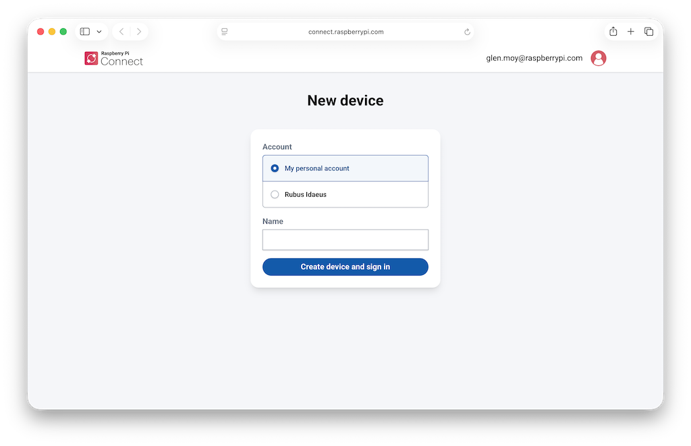
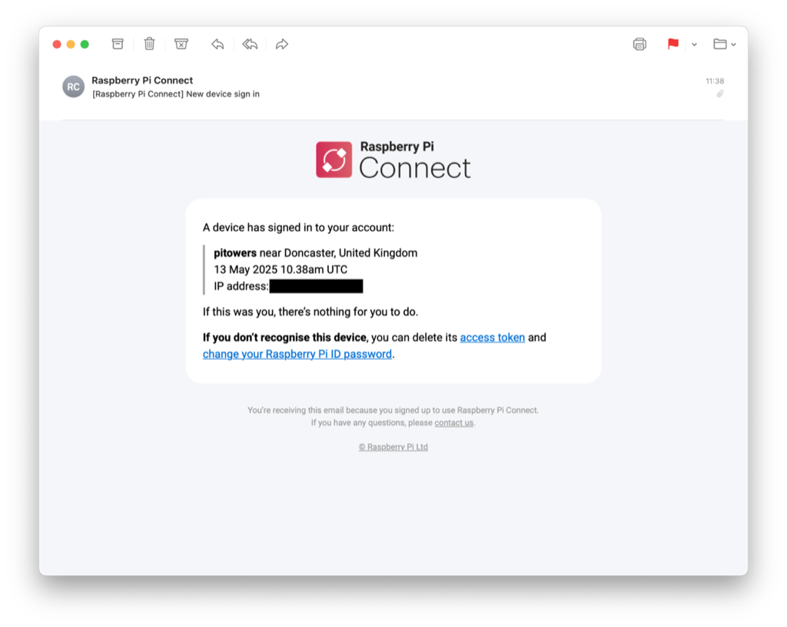

== Get started

There are three steps to get started with Connect:

. Sign in to https://connect.raspberrypi.com[connect.raspberrypi.com] with your Raspberry Pi ID. For more information, see xref:../services/id.adoc#create-a-raspberry-pi-id[Create a Raspberry Pi ID.]
. <<link-connect,Turn on>> the Connect service on your Raspberry Pi device, then <<link-connect,link it>> to your Connect account.
. From your PC, Mac, or other device, visit https://connect.raspberrypi.com[connect.raspberrypi.com] to remotely access your linked devices in a web browser.

[[link-connect]]
=== Turn on the Connect service and link your device

The full versions of Raspberry Pi OS include Connect, but the service is disabled by default. You must therefore turn it on before first use.

Turn Connect on and link it to your Raspberry Pi device using the desktop, the command line, or an auth key.

NOTE: Connect signs communication with your device's serial number. Moving your SD card between devices signs you out of Connect.

[tabs]
======
Desktop::
+
To enable Connect and link your device:
+
. Power on your Raspberry Pi device.
. From the Connect icon in the system tray, select **Turn On Raspberry Pi Connect**.
+
image::images/turn-on-connect.png[alt="The Connect interface, showing the Turn On Raspberry Pi Connect dropdown menu option.",width="100%"]
+
If this is the first time you have turned on the Connect service, or if you aren't signed in with your Raspberry Pi ID, a browser opens.
+
image::images/browser-sign-in.png[alt="The Connect page with a prompt to sign in to Connect with your Raspberry Pi ID.",width="100%"]
+
. Enter your Raspberry Pi ID email and password, then select **Sign In**.
. Follow the on-screen prompts to give your Raspberry Pi device a name and choose which Connect account to link it to.
+
image::images/new-device.png[alt="The Connect page inviting you to create a new device and sign in.",width="100%"]
+
If you're an administrator of an xref:../services/connect-for-organisations.adoc[organisation], select whether to add this device to your personal account or to a specific organisation.
+

+
. Select **Create device and sign in**.
+
When you've completed these steps, the Connect icon in the system tray of your Raspberry Pi device turns blue to indicate that it's signed in to the Connect service.
+
A notification is also sent to your registered email address to inform you that a new device is linked to your Connect account.
+

CLI::
+
. Turn Connect on by running the following command:
+
[source,console]
----
$ rpi-connect on
----
+
This turns the Connect service on, but doesn't sign you in.
+
. Sign in by running the following command:
+
[source,console]
----
$ rpi-connect signin
----
+
This command outputs something like the following:
+
----
Complete sign in by visiting https://connect.raspberrypi.com/verify/XXXX-XXXX
----
+
. Visit the verification URL on any device and sign in with your Raspberry Pi ID to complete the linking process.
+
When you've completed these steps, the Connect icon in the system tray of your Raspberry Pi device turns blue to indicate that it's signed in to the Connect service. A notification is also sent to your registered email address to inform you that a new device is linked to your Connect account.
+
You can also type `rpi-connect status` into the command line to check the status of the connection.
+

Auth key::
+
An auth key is a single-use, temporary token that lets you link a device to a Connect account automatically (without using the web interface). Personal auth keys expire six hours after creation; organisation auth keys expire between 1 and 90 days after creation (1 day by default).
+
The easiest way of creating and using an auth key is by using the xref:../computers/getting-started.adoc#imager-install[customisation options in Imager]. You can also manually create an auth key from the **Settings** page of a personal or organisation's Connect account, and organisation administrators can create auth keys using the xref:../services/connect-for-organisations.adoc#organisations-management-api[management API].
+
NOTE: Personal accounts can only have one auth key active at a time; organisations can have multiple auth keys active at once. You need a unique auth key for each device.
+
TIP: To use an auth key, ensure that you boot your Raspberry Pi and connect it to the internet before the expiry time shown on the Raspberry Pi Connect website.
+
After creating an auth key, provide this to your device using the `rpi-connect signin` command, or by writing the auth key to a file in your home directory.
+
Alternatively, save it to `+.config/com.raspberrypi.connect/auth.key+` in your home directory so that Connect detects it automatically.
+
To provide your auth key as a string, run the following command:
+
[source,console]
----
$ rpi-connect signin --auth-key=rpuak_123456
----
+
If you've saved your auth key to a file, you can pass its full path to the command by prefixing it with `+@+`:
+
[source,console]
----
$ rpi-connect signin --auth-key=@/home/alice/auth.key
----
+
When you've completed these steps, the Connect icon in the system tray of your Raspberry Pi device turns blue to indicate that it's signed in to the Connect service.
+
A notification is also sent to your registered email address to inform you that a new device is linked to your Connect account.
+

======

=== Security best practices

If you receive a notification email for a device that you don't recognise:

. Change your Raspberry Pi ID password immediately.
. Follow the instructions in xref:connect.adoc#manage-devices[Remove the device from Connect] to permanently disassociate it from your account.
. Consider xref:id.adoc#enable-two-factor-authentication[enabling two-factor authentication] to keep your account secure.

=== View linked devices

Connect lists all your linked devices on the **Devices** tab.

To view your devices:

. On any device, sign in to https://connect.raspberrypi.com[connect.raspberrypi.com].
. Select the **Devices** tab. Connect displays a list of linked devices.
+
image::images/devices.png[alt="The Connect page, showing the linked devices screen.",width="100%"]

If you've an organisation account, you can xref:../services/connect-for-organisations.adoc#search-filter-devices[search and filter] this list, and add xref:../services/connect-for-organisations.adoc#tag-devices[tags] to devices.