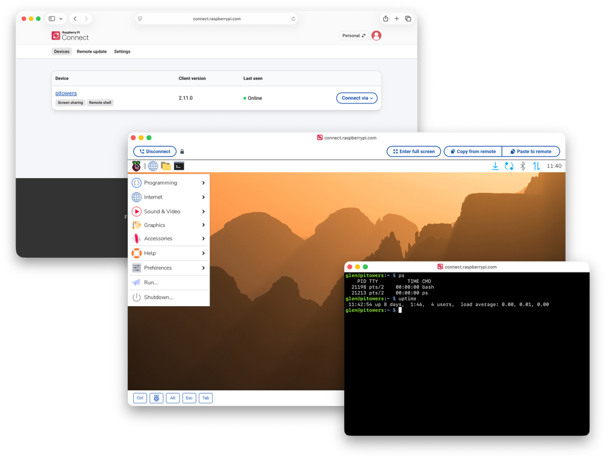
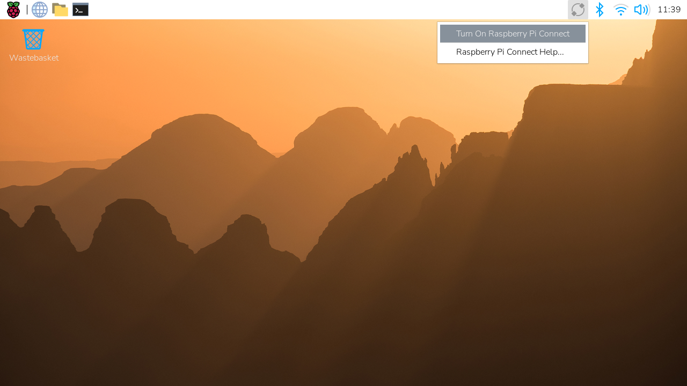

== Introduction

Raspberry Pi Connect provides secure access to your Raspberry Pi from anywhere in the world. It works by linking your device to your Connect account.

Connect is installed by default in Raspberry Pi OS Desktop and Raspberry Pi OS Full (desktop with recommended software).

An alternate **Lite** variant of Connect, which supports only remote shell access with no ability to screen share, is installed by default in Raspberry Pi OS Lite.

NOTE: To use Connect, your Raspberry Pi must run Raspberry Pi OS _Bookworm_ or later.

=== Connect service features

After you have linked your Raspberry Pi devices to your Connect account, you can interact with them in the following ways:

* <<screen-sharing,Screen sharing>>
* <<remote-shell,Remote shell>>
* <<remoteupdate-intro,Remote update>>

=== Connect menu

The Connect menu allows you to turn Connect on and off, sign in and out, and enable or disable the two remote access methods (shell and screen sharing).

=== Security and data storage

Connect uses a secure, encrypted connection.

By default, Connect communicates directly between your Raspberry Pi and your browser. However, when Connect can't establish a direct connection between your Raspberry Pi and your browser, we use a relay server. In such cases, Raspberry Pi only retains the metadata required to operate Connect.

=== Connect account types

There are two types of Connect account: personal and organisation.

The personal account provides a single user with a view of all the devices linked to their Connect account. This account type is free.

The organisation account allows multiple users to view devices linked to a shared Connect account. This account type is billed monthly. For more information, see xref:../services/connect-for-organisations.adoc[Connect for Organisations].